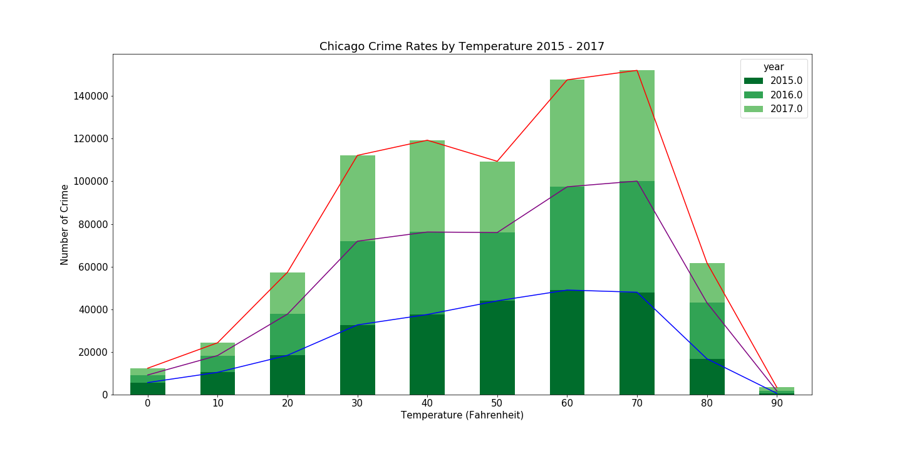
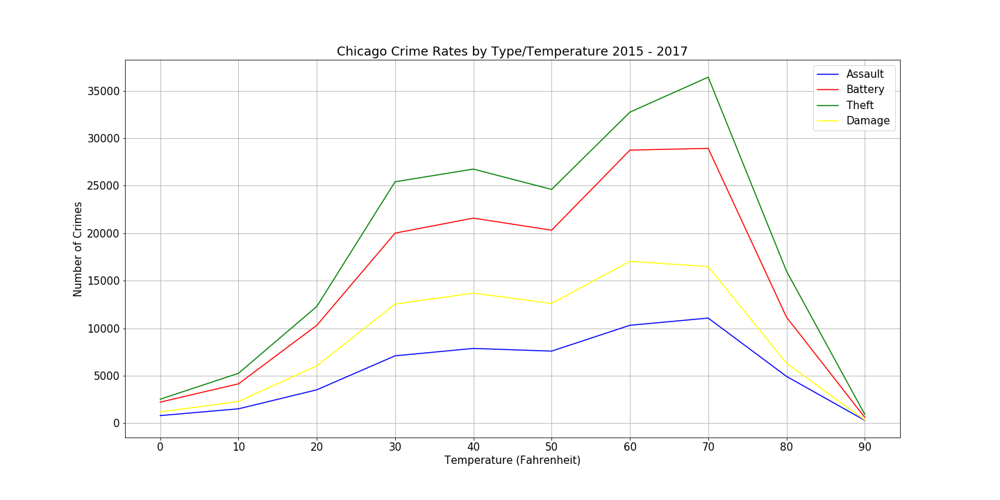
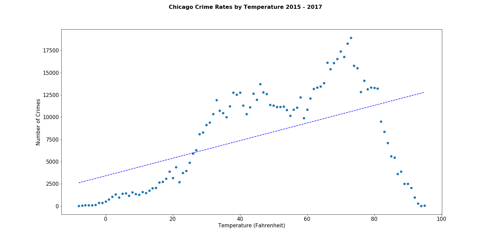

# 07-Project-1

## Jupyter Notebooks

1. GetDataFromAPIs.ipynb - retrieves the crime and weather data in json format and saves it to txt files for cleaning
by another jupyter notebook
2. CleanData.ipynb - cleans and merges the crime and weather data saved in txt files by GetDataFromAPIs.ipynb
3. TempCentralMeasuresOfTendency.ipynb - Calculates and displays the central measures of tendency for the crime temperature data
4. CrimeRatesByYearAndTemp - displays bar charts for the counts by crime type, displays the scatter chart for crime count by temperature, displays the crime count by temperature ranges by 10 degrees, displays the crime rate by temp by the top 4 crime types
6. Project-1.ipynb - displays crime count by month

## Does Weather affect Crime Rates?

## The Team
	Mano Velu
	Susan Young
	John Moore

## Motivation & Summary

1. Weather does impact crime rates
2. How does weather impact crime rates? Knowing this can help predict future crime rates based 	on forecasts. This will help departments to plan schedules based on weather to fit the changes in crime rate based on weather.
3. We were able to find relationships between weather and crime rates.

## Questions & Data

1. In order to make our research manageable, we focused on a specific city for a specific time range. We included multiple years to accommodate for changes in the seasons and to simply have more data.
2. We settled on Chicago for the time range of 2015-2017. 
3. In order to answer our questions, we needed weather data specific to the Chicago area. We also needed Chicago crime data for that same time range.

https://home.openweathermap.org/

https://data.cityofchicago.org/

All the project files are located in the google drive at the following location:
https://drive.google.com/drive/folders/12zKAAK-5-lbmn5oL5tTOgLlA-8VW0SAz

## Data Cleanup & Exploration

1. The cleanup process involved downloading the necessary data from the sources. The data was saved in json text files to prevent API overuse.
2. The json files were shared amongst the team for analysis via a team google drive due to data volume and limitations of github.
3. Due to the academic nature of this project, team members did their own cleaning based on the way we divided up the project.
4. The crime data for each year was concatenated to provide one crime data set.
5. The weather data was merged with the crime data based on the date/hour of the crime & the date/hour of the weather measurement.
6. Once the data was cleaned and merged it was saved to csv for each subsequent analysis.
7. The unexpected in the data
	We thought we would be able to get the historical weather data for free from OpenWeather. We had to do a bulk historical data purchase. This data is available through an API provided specifically four our bulk request. It is available in OpenWeather for 2 years.

	The weather data is in GMT which is 6 hours later than Chicago/Central time. This caused the weather data to begin 6 hours before our desired window and end 6 hours before our desired window. This resulted in a loss of 471 crime records from December 31 2017 during the merge with weather data and subsequent dropna to remove missing values.

	We had to take a close look at the API for the Chicago crime data as there is a limit parameter to manage large downloads. To avoid paging we simply set the limit to the row count specified for that specific year in the API docs.

	Rain and snow measurements are an accumulated value for the last three hours even though the measurements are hourly.

	Overall crime rates took a dip around 50 degrees in 2016 & 2017 but not 2015. This raises more questions about the data.

8. Temperatures were rounded for smoother charting and counts by degree.
9. To identify the data distribution we created a histogram with a mean line and looked at the standard deviations.
10. For sanity check, the min and max temperatures were captured, merged dataframe was previewed. Counts, types

## Data Analysis

1. To determine if weather impacted crime rates we:
    crime counts by type
    crime rates by temperature
    crime rates by year and temperature
    crime rates by type and temperature
	crime count by month 

	The date of provided in the crime data is translated to Year+Month. The crime data is grouped by month and plotted.
	The temperature was averaged over the month and a plot is made.
	Maximum temperature between 2015-2017 is 94.8 degrees Fahrenheit and minimum temperature is -7.
	To plot the temperature and crime count a “Logarithmic” plot is used.
	The plot below shows the crime rate by month varies sinusoidal over the year, peaking during June and July and vanning to a low during February.

2. Looking at these charts it was easy to see that weather impacts crime rates

## Key Statistics

	The city of Chicago 2015-2017
	26307 weather measurements
	802022 Crimes
	Minimum temperature -8
	Maximum temperature 95
	Mean temperature 55
	Peak crime months June & July
	Least crime month February
	Top 4 crimes - Theft, Battery, Damage, Assault

	Data loss 471 crime records due to 6 hour weather report gap between GMT & CST

## Discussion

1. We found crime rates to be lower at either end of the temperature range. Lower as temperature is lower and higher as the temperature rises. However, as the temperature gets too high, crime rates tend to drop.
2. We did find what we expected to find regarding the relationship between weather and crime.
3. The top 4 crime types are affected similarly by temperature.
4. You can infer that when the weather is intolerable, the motivation to commit crimes is lower due to extreme temperatures, either high or low.

## Post Mortem

1. Difficulties arose trying to plot all crimes at all temperature points. Rounding and Binning of the data into bins of 10 degrees made the charting smoother.
3. We were interested to know whether there were any particular crime types that weren’t impacted by weather but would require more time to analyze.
4. If we had more time we would focus on crime by community, district, ward and beat. The Chicago crime data is rich and free from the City of Chicago.

=======
Does weather affect crimerate in Chicago?
•	Title Slide
o	Does weather impact the crime rate
	Mano Velu
	Susan Young
	John Moore
•	Motivation & Summary Slide
o	Weather does impact crime rates
o	How does weather impact crime rates? Knowing this can help predict future crime rates based on forecasts. This will help departments to plan schedules based on weather to fit the changes in crime rate based on weather.
o	We were able to find relationships between weather and crime rates.
•	Questions & Data
o	In order to make our research manageable, we focused on a specific city for a specific time range. We included multiple years to accommodate for changes in the seasons and to simply have more data.
o	We settled on Chicago for the time range of 2015-2017. 
o	In order to answer our questions, we needed weather data specific to the Chicago area. We also needed Chicago crime data for that same time range.
	https://home.openweathermap.org/
	https://data.cityofchicago.org/
All the files are located in the google drive at the following location:
https://drive.google.com/drive/folders/12zKAAK-5-lbmn5oL5tTOgLlA-8VW0SAz

•	Data Cleanup & Exploration
o	The cleanup process involved downloading the necessary data from the sources. The data was saved inn json text files to prevent API overuse.
o	The json files were shared amongst the team for analysis via a team google drive due to data volume and limitations of github.
o	Due to the academic nature of this project, team members did their own cleaning based on the way we divided up the project.
o	The crime data for each year was concatenated to provide one crime data set.
o	The weather data was merged with the crime data based on the date/hour of the crime & the date/hour of the weather measurement.
o	Once the data was cleaned and merged it was saved to csv for each subsequent analysis.
o	The unexpected in the data
	We thought we would be able to get the historical weather data for free from OpenWeather. We had to do a bulk historical data purchase. This data is available through an API provided specifically for our bulk request. It is available in OpenWeather for 2 years.
	The weather data is in GMT which is 6 hours later than Chicago/Central time. This caused the weather data to begin 6 hours before our desired window and end 6 hours before our desired window.
	This resulted in a loss of 471 crime records from December 31 2017 during the merge with weather data and subsequent dropna to remove missing values.
	The amount of data downloaded was less than indicated in the API
	We had to take a close look at the API for the Chicago crime data as there is a limit parameter to manage large downloads. To avoid paging we simply set the limit to the row count specified for that specific year in the API docs.
	Rain and snow measurements are an accumulated value for the last three hours even though the measurements are hourly.
	Overall crime rates took a dip around 50 degrees in 2016 & 2017 but not 2015. This raises more questions about the data.
o	Temperatures were rounded for smoother charting and counts by degree.
o	To ensure our data had a normal distribution we created a histogram with a mean line and looked at the standard deviations.
o	For sanity check, the min and max temperatures were captured, merged dataframe was previewed. Counts, types
 
 
•	Data Analysis
o	To determine if weather impacted crime rates we:
	graphed crime counts by type to understand crime volume by type
	crime rates by temperature
	crime rates by year and temperature
	crime rates by type and temperature
o	Looking at these charts it was easy to see that weather impacts crime rates
•	The following analysis shows the crime count by month. The date of provided in the crime data is translated to Year+Month. The crime data is grouped by month and plotted.
•	The temperature was averaged over the month and a plot is made.
•	Maximum temperature between 2015-2017 is 94.8 degrees Fahrenheit and minimum temperature is -7.
•	To plot the temperature and crime count a “Logarithmic” plot is used.
•	The plot below shows the crime rate by month varies sinusoidal over the year, peaking during June and July and vanning to a low during February.
 
 
•	Discussion
o	We found crime rates to be lower at either end of the temperature range. Lower as temperature is lower and higher as the temperature rises. However, as the temperature gets too high, crime rates tend to drop.
o	We did find what we expected to find regarding the relationship between weather and crime.
o	You can infer that when the weather is intolerable, the motivation to commit crimes is lower due to extreme temperatures, either high or low.
•	Post Mortem
o	Difficulties arose trying to plot all crimes at all temperatures. Binning of the data into bins of 10 degrees made the charting smoother.
o	Discuss any difficulties that arose, and how you dealt with them
o	We were interested to know whether there were any particular crime types that weren’t impacted by weather but would require more time to analyze.
o	If we had more time we would focus on crime by community, district, ward and beat. The Chicago crime data is rich and free from the City of Chicago.
•	Questions
o	Open-floor Q&A with the audience

